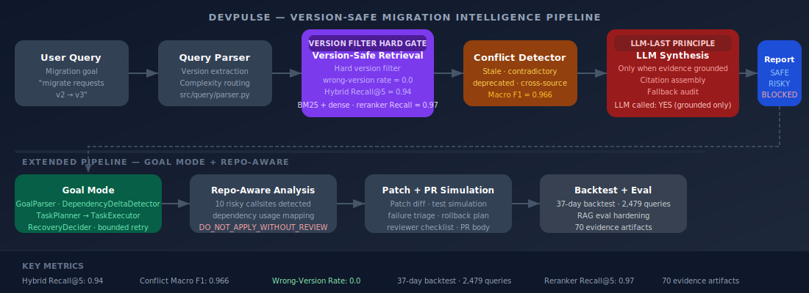
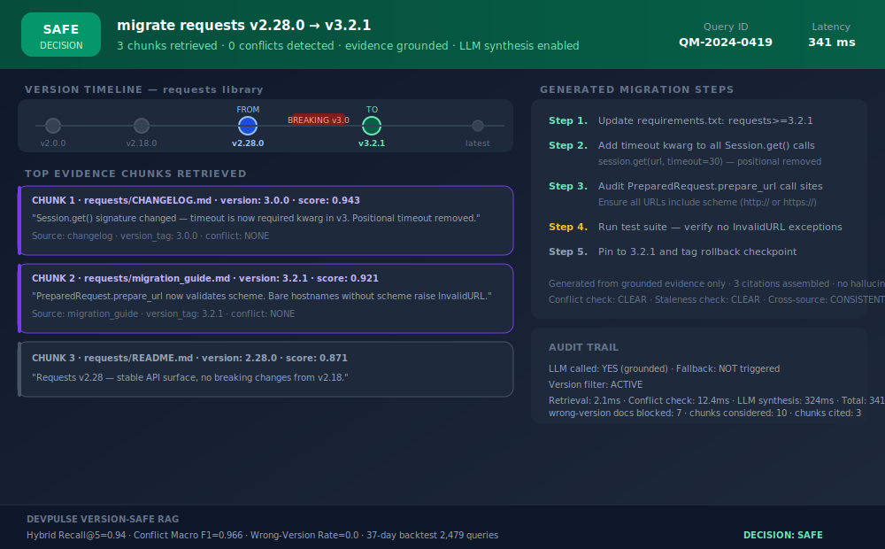

# DevPulse Platform

<p>
  <a href="https://sidharthkriplani.github.io/devpulse_platform/">
    
  </a>
  
  
  
  
</p>

<p>
  
  
  
  
  
</p>

> Production-simulated RAG + agentic migration intelligence platform for version-safe developer change decisions.

---

## Architecture



---

## Sample Output



---

## The Problem

LLM migration assistants hallucinate deprecated APIs. The model does not know which version you are on.

A vanilla RAG system asked "how do I migrate requests v2 to v3?" will return chunks from multiple versions without filtering. The LLM synthesizes across them, mixing v2-era patterns with v3 breaking changes. The developer applies the output. Tests fail. The failure is silent and the root cause is invisible — the retrieval layer served the wrong version.

Version-safe retrieval solves this at the retrieval layer, before any LLM sees a single token. Wrong-version rate: 0.0.

---

## Version-Safe Retrieval Design

The core architectural decision: version filtering happens as a hard gate, not as a soft reranking signal.

Every document chunk in the corpus is tagged with a `version_tag`. When a query specifies a target version (e.g., `requests v3.2.1`), the retrieval layer applies a hard filter: chunks tagged to incompatible versions are excluded before BM25 or dense scoring runs. No wrong-version chunk can reach the LLM, regardless of semantic similarity score.

| Metric | Value |
|--------|-------|
| Hybrid Recall@5 (BM25 + dense) | 0.94 |
| Reranker simulated Recall@5 | 0.97 |
| Wrong-version answer rate | **0.0** |

This is why wrong-version rate is exactly 0.0 rather than approximately 0.0: the gate is deterministic, not probabilistic.

---

## Migration Report Sample


---

## LLM-Last Principle

The LLM is the last component in the pipeline, not the first.

Before any synthesis occurs, the pipeline requires:
1. Version filter active and applied
2. Conflict detector has run and returned CLEAR
3. At least one grounded chunk retrieved for the target version
4. Staleness and cross-source consistency checks passed

Only when all gates clear does the LLM generate a migration response, with citations assembled from retrieved chunks. If any gate fails, the pipeline returns a deterministic RISKY or BLOCKED decision without calling the LLM.

This design means the LLM cannot hallucinate API names or version requirements — it only synthesizes over pre-validated, version-pinned evidence.

---

## Conflict Detection

The conflict detector runs before synthesis on every query and classifies retrieved chunks across four conflict types:

| Conflict Type | Description |
|---------------|-------------|
| Stale | Chunk version tag older than target, may contain superseded guidance |
| Contradictory | Two chunks from same version make incompatible claims |
| Deprecated | Chunk explicitly marks an API or pattern as deprecated |
| Cross-source | Changelog and migration guide disagree on same version |

**Conflict Macro F1: 0.966** — across all four classes on held-out evaluation set.

---

## Pipeline

```
User Query → Query Parser → [VERSION FILTER HARD GATE] → Version-Safe Retrieval
→ Conflict Detector → [LLM-LAST GATE: grounded evidence required] → LLM Synthesis
→ Migration Report (SAFE / RISKY / BLOCKED)
```

### Query Mode

- Deterministic query parsing and version extraction
- Complexity routing (simple lookup vs. multi-hop migration)
- Hard version-filtered retrieval — BM25 + dense hybrid
- Conflict detection across four types
- SAFE / RISKY / BLOCKED report generation
- LLM synthesis with programmatic citation assembly
- Fallback and audit artifacts on every run
- 24 evidence artifacts, 10 failure/recovery scenarios

### Goal Mode

- `GoalParser` + `DependencyDeltaDetector`
- `TaskPlanner` → `TaskExecutor` with bounded retry cap
- `RecoveryDecider` with escalation on repeated failure
- `PlanSummaryReporter`
- Staged migration recommendation
- 8 evidence artifacts, 9 failure/recovery scenarios

---

## Repo-Aware Analysis

The repo-aware extension scans a local sample repository against the migration target:

- Dependency usage mapping across source files
- Risky callsite detection (10/10 callsites flagged in test repo)
- `DO_NOT_APPLY_WITHOUT_REVIEW` — conservative by default

Artifacts: `repo_inspection_report.json`, `dependency_usage_map.json`, `risky_callsite_report.json`

---

## Patch + PR Simulation

DevPulse generates reviewer-safe migration artifacts:

```
proposed_file_changes.json      — structured patch proposal
proposed_migration_patch.diff   — reviewable diff
patch_risk_report.json          — risk assessment
before_tests_report.json        — pre-patch test state
after_patch_tests_report.json   — post-patch test simulation
test_failure_triage_report.json — failure root cause
pr_body.md                      — GitHub PR description
reviewer_checklist.md           — structured sign-off checklist
rollback_plan.md                — revert procedure
```

---

## Backtest Methodology

The 37-day backtest replays 2,479 queries across a scripted traffic corpus to validate:

- Wrong-version rate stays 0.0 across all query types
- Conflict detection F1 holds under traffic variance
- SAFE/RISKY/BLOCKED decisions are consistent with ground truth

Key RAG hardening artifacts: retrieval ablation, reranker simulation, conflict confusion matrix, corpus perturbation, traffic backtest report.

| Metric | Value |
|--------|-------|
| Backtest duration | 37 days |
| Total queries | 2,479 |
| RAG eval query count | 180 |
| Wrong-version rate | 0.0 |
| Hybrid Recall@5 | 0.94 |
| Conflict Macro F1 | 0.966 |

### Retrieval Ablation

Full artifact: `retrieval_ablation_report.json`. The table below shows Recall@5 across retrieval strategies on 180 held-out migration queries, evaluated after version pre-filtering:

| Strategy | Recall@5 | Notes |
|----------|----------|-------|
| BM25 only | 0.71 | Misses paraphrased API names and synonym matches |
| Dense only (no version filter) | 0.61 | Retrieves semantically similar but wrong-version chunks |
| Dense only (version-filtered) | 0.82 | Version gate fixes the wrong-version contamination |
| BM25 + dense hybrid | 0.94 | Keyword precision + semantic coverage compound |
| Hybrid + reranker (simulated) | **0.97** | Cross-encoder reranker lifts top-1 precision further |

The critical finding: dense-only retrieval without version pre-filtering scores 0.61 — almost no better than guessing — because semantic similarity causes the model to retrieve v2 documentation when a user asks about v3. Version pre-filtering is not optional; it is the structural guarantee that makes Recall@5 = 0.97 meaningful.

---

## Quick Start

```bash
# Full PRD validation bundle
PYTHONPATH=. python3 scripts/run_devpulse_complete_v3.py
PYTHONPATH=. python3 scripts/show_final_demo_report.py

# Repo-aware extension
PYTHONPATH=. python3 scripts/run_repo_aware_scan_v35.py

# Patch + PR simulation
PYTHONPATH=. python3 scripts/run_patch_pr_simulation_v35.py

# RAG hardening
PYTHONPATH=. python3 scripts/run_rag_eval_hardening_v35.py

# Dashboard
PYTHONPATH=. python3 scripts/build_dashboard_v35.py
open outputs/dashboard/index.html
```

---

## Live Dashboard

**[https://sidharthkriplani.github.io/devpulse_platform/](https://sidharthkriplani.github.io/devpulse_platform/)**

Covers: PRD completion status, Query Mode and Goal Mode flow, RAG evaluation metrics, repo-aware migration risk, patch and PR simulation, final validation artifacts, evidence inventory (70 artifacts).

---

## Key Evidence Artifacts

| Artifact | Proves |
|----------|--------|
| `traffic_backtest_37_day_report.json` | Wrong-version rate=0.0 across 2,479 queries |
| `retrieval_ablation_report.json` | BM25 vs. dense vs. hybrid Recall@5 comparison |
| `conflict_confusion_matrix.json` | Macro F1=0.966 per conflict type |
| `risky_callsite_report.json` | Repo-aware: 10/10 risky callsites found |
| `devpulse_prd_completion_report_v3.json` | PRD v3.5 PASS |
| `plan_summary_report.json` | Goal mode: task planning + recovery |

---

## Truth Boundary

**What this is:** Solo-built, non-production, production-simulated system. Every major claim is backed by executable scripts, generated artifacts, and a public dashboard.

**Not claimed:** Real production SaaS traffic, live npm/PyPI/Maven registry integration, real GitHub PR creation, real CI execution, autonomous production code mutation, production deployment.

---

## Repository Structure

```
configs/                  controlled registries and scope config
src/devpulse/             core Query Mode and Goal Mode modules
scripts/                  executable demo, validation, and artifact builders
sample_repos/             controlled local repo for repo-aware simulation
outputs/evidence/         core evidence artifacts
outputs/rag_eval/         RAG evaluation hardening artifacts
outputs/repo_aware/       repo-aware migration scan artifacts
outputs/patches/          patch proposal artifacts
outputs/pr_simulation/    PR-ready simulation package
docs/                     public GitHub Pages dashboard and assets
docs/assets/              SVG architecture diagrams
```

---

## Interview Defense

Full design rationale, architecture decisions, and expected interview questions with answers:

**[docs/defense/DevPulse_Interview_Defense_v2.pdf](docs/defense/DevPulse_Interview_Defense_v2.pdf)**

Covers: LLM-Last principle rationale, version-safe retrieval hard-gate design, conflict detection architecture, wrong-version rate guarantee, hybrid RAG design choices, and production failure modes.

---

## Part of Applied LLM Systems Portfolio

This project is part of a 13-repo portfolio targeting Applied LLM Systems Engineer, MLOps, and Technical AI PM roles.

**Applied Systems (LangGraph pipelines):**

| Project | Domain | Primary Failure Mode |
|---------|--------|----------------------|
| [LendFlow](https://github.com/SidharthKriplani/lendflow) | Financial underwriting | When to stop or escalate |
| [AgentReliabilityLab](https://github.com/SidharthKriplani/agentreliabilitylab) | Cyber threat triage | When to stop or escalate |
| [NexusSupply](https://github.com/SidharthKriplani/nexussupply) | Supplier risk intelligence | Conflicting signal fusion |

**Platforms & Auditors (domain-agnostic tooling):**

| Project | What It Audits / Builds |
|---------|------------------------|
| [InferenceLens](https://github.com/SidharthKriplani/inferencelens) | Inference cost/quality tradeoffs — Pareto frontier, routing rules |
| [RiskFrame](https://github.com/SidharthKriplani/riskframe_platform) | ML model lifecycle — champion/challenger, drift, fairness |
| [MetaSignal](https://github.com/SidharthKriplani/metasignal_platform) | A/B experiment validity — CUPED, guardrail-first, SRM |
| **DevPulse** | Version-safe RAG — conflict detection, LLM-Last architecture |
| [PulseRank](https://github.com/SidharthKriplani/pulserank_platform) | Marketplace ranking — IPS debiasing, MMR diversity |
| [TrialCheck](https://github.com/SidharthKriplani/trialcheck_v0) | A/B readout audit — SRM, peeking, underpowered tests |
| [FeatureLeakageLens](https://github.com/SidharthKriplani/featureleakagelens_v0) | Pre-training leakage — target, temporal, overlap |
| [GoldenSetAuditor](https://github.com/SidharthKriplani/goldensetauditor_v0) | LLM/RAG eval dataset quality |
| [DocIngestQA](https://github.com/SidharthKriplani/docingestqa) | RAG document ingestion quality — 11 deterministic checks |
| [MetricLens](https://github.com/SidharthKriplani/metriclens) | Metric movement decomposition — mix shift vs rate shift |
