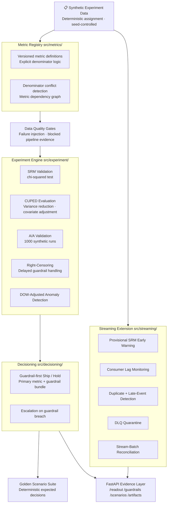

---

## Architecture

```mermaid
flowchart TD
    RAW["📋 Synthetic Experiment Data\nDeterministic assignment · seed-controlled"] --> MR

    subgraph MR["Metric Registry  src/metrics/"]
        MDEF["Versioned metric definitions\nExplicit denominator logic"]
        CONF["Denominator conflict detection\nMetric dependency graph"]
    end

    MR --> DQ["Data Quality Gates\nFailure injection · blocked pipeline evidence"]
    DQ --> EXP

    subgraph EXP["Experiment Engine  src/experiment/"]
        SRM["SRM Validation\nchi-squared test"]
        CUP["CUPED Evaluation\nVariance reduction · covariate adjustment"]
        AA["A/A Validation\n1000 synthetic runs"]
        RC["Right-Censoring\nDelayed guardrail handling"]
        DOW["DOW-Adjusted Anomaly Detection"]
    end

    EXP --> DEC

    subgraph DEC["Decisioning  src/decisioning/"]
        GF["Guardrail-first Ship / Hold\nPrimary metric + guardrail bundle"]
        ES["Escalation on guardrail breach"]
    end

    DEC --> GS["Golden Scenario Suite\nDeterministic expected decisions"]
    DEC --> API["FastAPI Evidence Layer\n/readout /guardrails /scenarios /artifacts"]

    subgraph STR["Streaming Extension  src/streaming/"]
        SRM2["Provisional SRM Early Warning"]
        LAG["Consumer Lag Monitoring"]
        DUP["Duplicate + Late-Event Detection"]
        DLQ["DLQ Quarantine"]
        REC["Stream-Batch Reconciliation"]
    end

    RAW --> STR
    STR --> API
```

---

