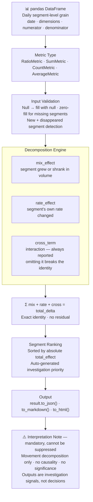

## How it works

```mermaid
flowchart TD
    DF["📊 pandas DataFrame\nDaily segment-level grain\ndate · dimensions · numerator · denominator"] --> MT

    MT["Metric Type\nRatioMetric · SumMetric · CountMetric · AverageMetric"]
    MT --> VAL["Input Validation\nNull → fill with null · zero-fill for missing segments\nNew + disappeared segment detection"]
    VAL --> DEC

    subgraph DEC["Decomposition Engine"]
        ME["mix_effect\nsegment grew or shrank in volume"]
        RE["rate_effect\nsegment's own rate changed"]
        CT["cross_term\ninteraction — always reported\nomitting it breaks the identity"]
    end

    DEC --> SUM["Σ mix + rate + cross = total_delta\nExact identity · no residual"]
    SUM --> RANK["Segment Ranking\nSorted by absolute total_effect\nAuto-generated investigation priority"]

    RANK --> OUT["Output\nresult.to_json() · to_markdown() · to_html()"]

    OUT --> NOTE["⚠️ Interpretation Note — mandatory, cannot be suppressed\nMovement decomposition only · no causality · no significance\nOutputs are investigation signals, not decisions"]
```
