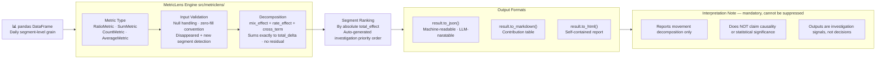

## How it works

```mermaid
flowchart LR
    DF["📊 pandas DataFrame\nDaily segment-level grain"] --> ML

    subgraph ML["MetricLens Engine  src/metriclens/"]
        MT["Metric Type\nRatioMetric · SumMetric\nCountMetric · AverageMetric"]
        VAL["Input Validation\nNull handling · zero-fill convention\nDisappeared + new segment detection"]
        DEC["Decomposition\nmix_effect + rate_effect + cross_term\nSums exactly to total_delta · no residual"]
    end

    MT --> VAL --> DEC

    DEC --> RANK["Segment Ranking\nBy absolute total_effect\nAuto-generated investigation priority order"]

    RANK --> OUT

    subgraph OUT["Output Formats"]
        JSON["result.to_json()\nMachine-readable · LLM-naratable"]
        MD["result.to_markdown()\nContribution table"]
        HTML["result.to_html()\nSelf-contained report"]
    end

    subgraph NOTE["Interpretation Note — mandatory, cannot be suppressed"]
        N1["Reports movement decomposition only"]
        N2["Does NOT claim causality or statistical significance"]
        N3["Outputs are investigation signals, not decisions"]
    end

    OUT --> NOTE
```

---

